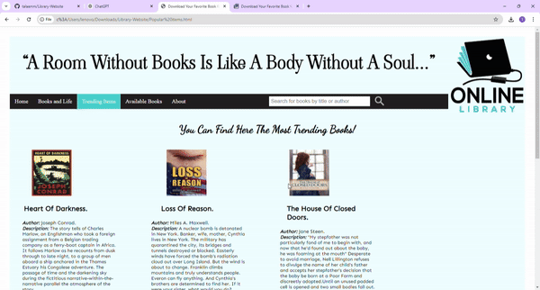
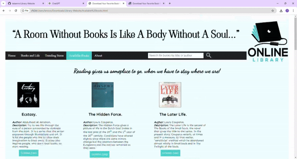
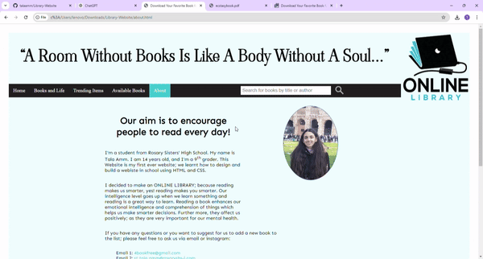
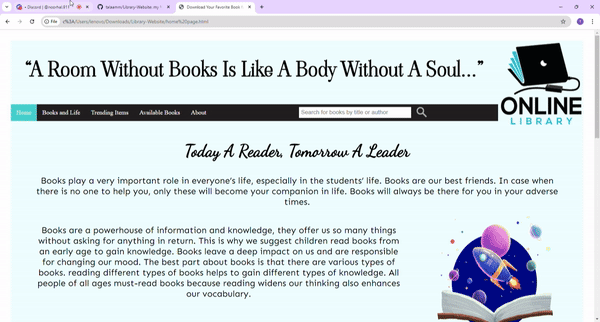
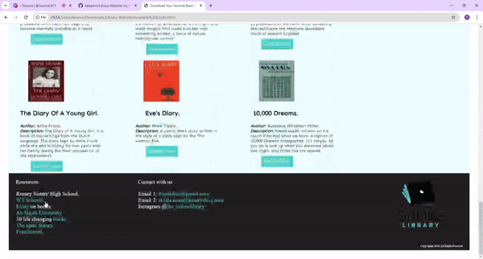
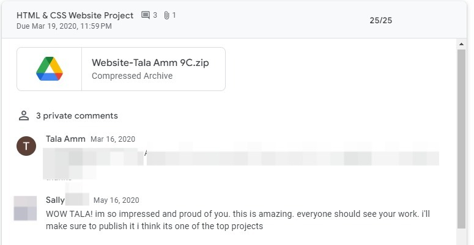

Hello There!
here is Tala Amm, i liked to share with you my first ever project when i was in school yet (2019)
i started in the field of programming through web development (Html, Css, Js)

here i decided to make an Online Library where users are allowed to download books as pdf.
i decided to do this because we were in the very beggining of COVID-19

first of all i had my homePage:
which talked about the Importance of Books, Books as Sources of Knowledge, Different Types of Books, Benefits of Reading:

i also had a page named Books and life:
which also said that Books Have Multiple Purposes, Reading Enhances Cognitive and Emotional Skills, Different Books for Different Needs, The Overall Importance of Reading. it also included Supportive Resources and Contact Information it mentions resources for further information on the value of reading, including schools and libraries. (through linked yt vids)

i had a page named 'Trending Books' where you can find the most famous books 
(they were not really the most famous😅 since i was a very beginner developer i chose them myself)
you can find for each book: the coverPage, the author, a brief description about the book, and a clickable button to download the book as PDF.

another page with the all available books in the online Library
also, you can find for each book: the coverPage, the author, a brief description about the book, and a clickable button to download the book as PDF.

last but not least, the about page which contains some info about me :)

i would like to mention that all the pages were linked to each other, and every link in the footer has a certain job
check the GIF below👇:

(the email click at the end pop up a new window where "send to:" field is my email, but it didnt appear in the screen record)

and this was my IT teacher's comment🤣it meant a lot for me at that time

# **!!! THANK YOU !!!**