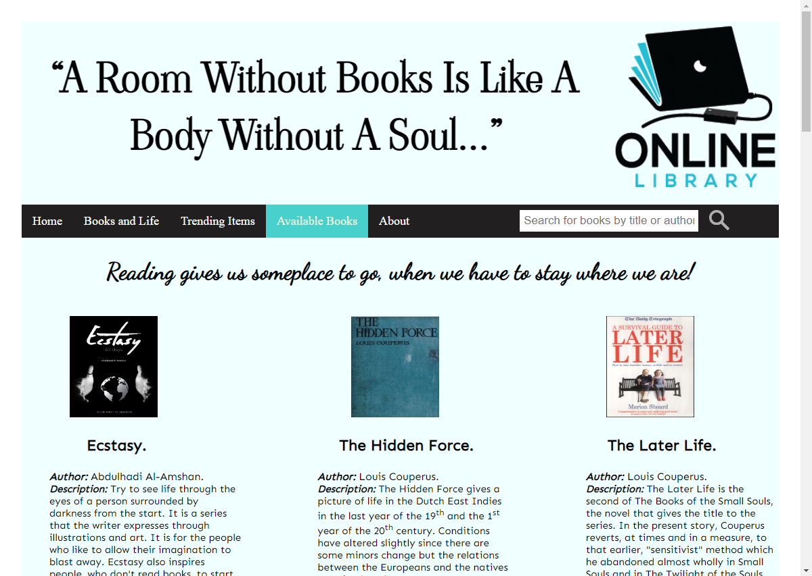
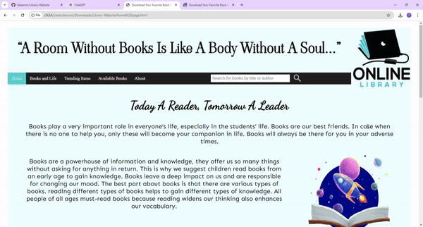
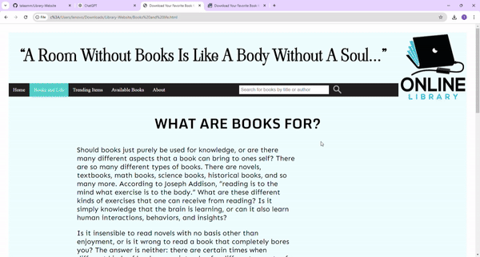

Hello There!
here is Tala Amm, i liked to share with you my first ever project when i was in school yet (2019)
i started in the field of programming through web development (Html, Css, Js)

here i decided to make an Online Library where users are allowed to download books as pdf.
i decided to do this because we were in the very beggining of COVID-19

first of all i had my homePage:
which talked about the Importance of Books, Books as Sources of Knowledge, Different Types of Books, Benefits of Reading:

i also had a page named Books and life:
which also said that Books Have Multiple Purposes, Reading Enhances Cognitive and Emotional Skills, Different Books for Different Needs, The Overall Importance of Reading. it also included Supportive Resources and Contact Information it mentions resources for further information on the value of reading, including schools and libraries. (through linked yt vids)

